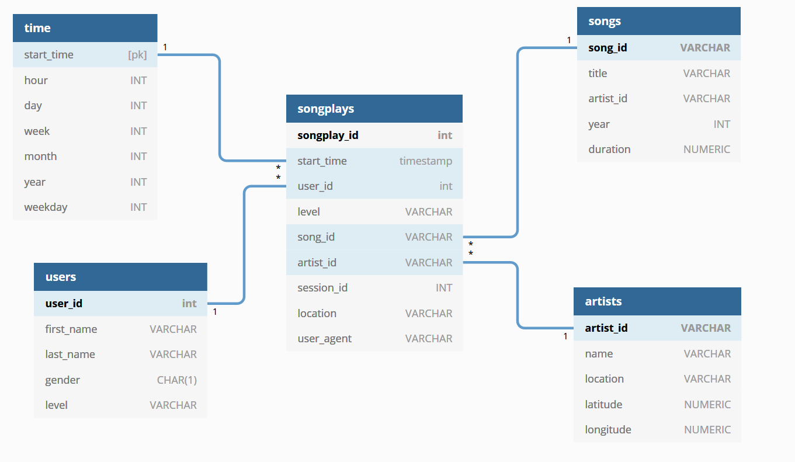

# Data Lake on AWS S3 for Sparkify
##### Table of Contents  
- [Introduction](#introduction)
- [Project Structure](#Project\ Structure)
    - [Datasets](#Datasets)
        - [Song Dataset](#Song\ Dataset)
        - [Log Dataset](#Log\ Dataset)
    - [Data Schema](#Data\ Schema)
        - [Fact Tables](#Fact\ Tables)
        - [Dimension Tables](#Dimension\ Tables)
    - [Files](#Files)
- [Usage](#usage)

## Introduction

* A music streaming startup, Sparkify, has grown their user base and song database and want to move their processes and data onto the cloud. Their data resides in S3, in a directory of JSON logs on user activity on the app, as well as a directory with JSON metadata on the songs in their app.

* The goal of the project is to build an ETL pipeline that extracts their data from S3, processes them using Spark, and loads the data back into S3 as a set of dimensional tables for their analytics team to continue finding insights in what songs their users are listening to. 

## Project Structure
### Datasets
* **Song Dataset**:
    The song dataset is a subset of real data from the [Million Song Dataset](https://labrosa.ee.columbia.edu/millionsong). Each file is in JSON format and contains metadata about a song and the artist of that song. The files are partitioned by the first three letters of each song's track ID. For example, here are filepaths to two files in this dataset.

    ```
    song_data/A/B/C/TRABCEI128F424C983.json
    song_data/A/A/B/TRAABJL12903CDCF1A.json
    ```
    And below is an example of what a single song file, `TRAABJL12903CDCF1A.json`, looks like.
    ```
    {"num_songs": 1, "artist_id": "ARJIE2Y1187B994AB7", "artist_latitude": null, "artist_longitude": null, "artist_location": "", "artist_name": "Line Renaud", "song_id": "SOUPIRU12A6D4FA1E1", "title": "Der Kleine Dompfaff", "duration": 152.92036, "year": 0}
    ```
    The song data is in S3 buckets hosted at AWS which can be reached by:
    ```s3://udacity-dend/song_data```
    
* **Log Dataset**:
    The second dataset consists of log files in JSON format generated by this event simulator based on the songs in the dataset above. These simulate app activity logs from a music streaming app based on specified configurations.

    The log files in the dataset are partitioned by year and month. For example, here are filepaths to two files in this dataset.

    ```
    log_data/2018/11/2018-11-12-events.json
    log_data/2018/11/2018-11-13-events.json
    ```
    And below is an example of what the data in a log file, `2018-11-12-events.json`, looks like.
    
    
    The log data is in S3 buckets hosted at AWS which can be reached by:
    
    ```s3://udacity-dend/log_data```

### Data Schema
The schema used for this project is the Star Schema: There is one main fact table containing all the measures associated to each event, and 4 dimension tables, each with a primary key that is being foreign key on the fact table.



#### Fact Tables
* **songplays** - records in log data associated with song plays i.e. records with page `NextSong` and partitioned by *year* and *month* for performance
    * `songplay_id` (INT) PRIMARY KEY: ID of each user song play 
    * `start_time` (TIMESTAMP) NOT NULL: Timestamp of beggining of user activity
    * `user_id` (INT) NOT NULL: ID of user
    * `level` (TEXT): User level {free | paid}
    * `song_id` (TEXT) NOT NULL: ID of Song played
    * `artist_id` (TEXT) NOT NULL: ID of Artist of the song played
    * `session_id` (INT): ID of the user Session 
    * `location` (TEXT): User location 
    * `user_agent` (TEXT): Agent used by user to access Sparkify platform
#### Dimension Tables
* **users** - users in the app
    * `user_id` (INT) PRIMARY KEY: ID of user
    * `first_name` (TEXT) NOT NULL: Name of user
    * `last_name` (TEXT) NOT NULL: Last Name of user
    * `gender` (TEXT): Gender of user {M | F}
    * `level` (TEXT): User level {free | paid}
* **songs** - songs in music database, partitioned by *year* and *artist* for performance
    * `song_id` (TEXT) PRIMARY KEY: ID of Song
    * `title` (TEXT) NOT NULL: Title of Song
    * `artist_id` (TEXT) NOT NULL: ID of song Artist
    * `year` (INT): Year of song release
    * `duration` (FLOAT) NOT NULL: Song duration in milliseconds
* **artists** - artists in music database
    * `artist_id` (TEXT) PRIMARY KEY: ID of Artist
    * `name` (TEXT) NOT NULL: Name of Artist
    * `location` (TEXT): Name of Artist city
    * `lattitude` (FLOAT): Lattitude location of artist
    * `longitude` (FLOAT): Longitude location of artist
* **time** - timestamps of records in <b>songplays</b> broken down into specific units and partitioned by *year* and *month* for performance
    * `start_time` (TIMESTAMP) PRIMARY KEY: Timestamp of row
    * `hour` (INT): Hour associated to start_time
    * `day` (INT): Day associated to start_time
    * `week` (INT): Week of year associated to start_time
    * `month` (INT): Month associated to start_time 
    * `year` (INT): Year associated to start_time
    * `weekday` (INT): Day number of week day associated to start_time

### Files

Files used on the project:
1. **img** folder for images used in README.md file.
2. **dl.cfg** contains the AWS keys to connect AWS S3.
3. **etl.py** reads and processes all the files from song_data and log_data and loads them into the tables. 
4. **README.md** current file, provides discussion on the project.


## Usage
1. To run this project you will need to fill the following information, and save it as *dl.cfg* in the project root folder.
(Sparkify will supply the AWS Redshift information needed below and also create a S3 bucket named `sparkify-dend` where output results will be stored.)
```
[AWS]
AWS_ACCESS_KEY_ID=****
AWS_SECRET_ACCESS_KEY=****
```

2. Finally, run the *etl*.*py* script to extract data from the files in S3, processes them using Spark, and loads the data back into S3 as a set of dimensional tables.

    `$ python etl.py`


